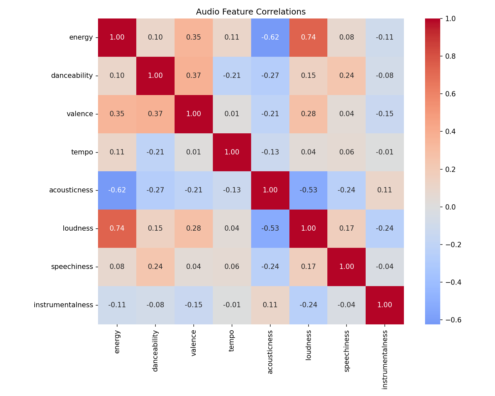
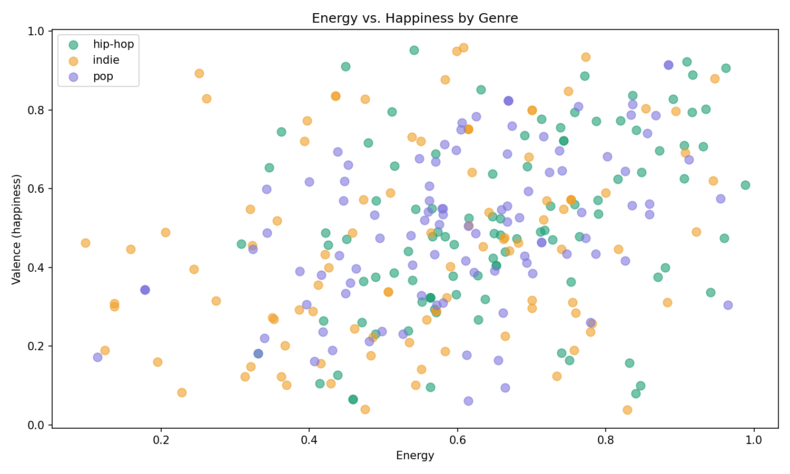
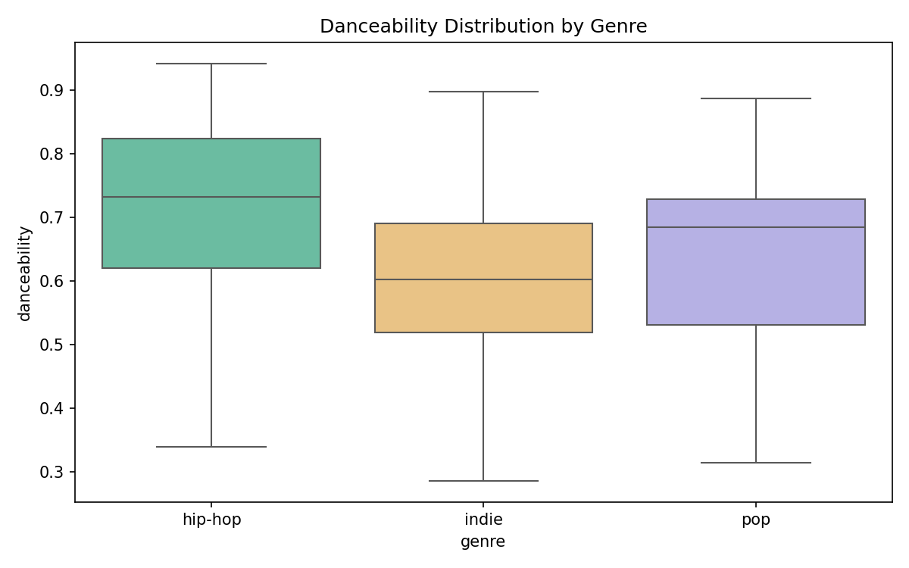
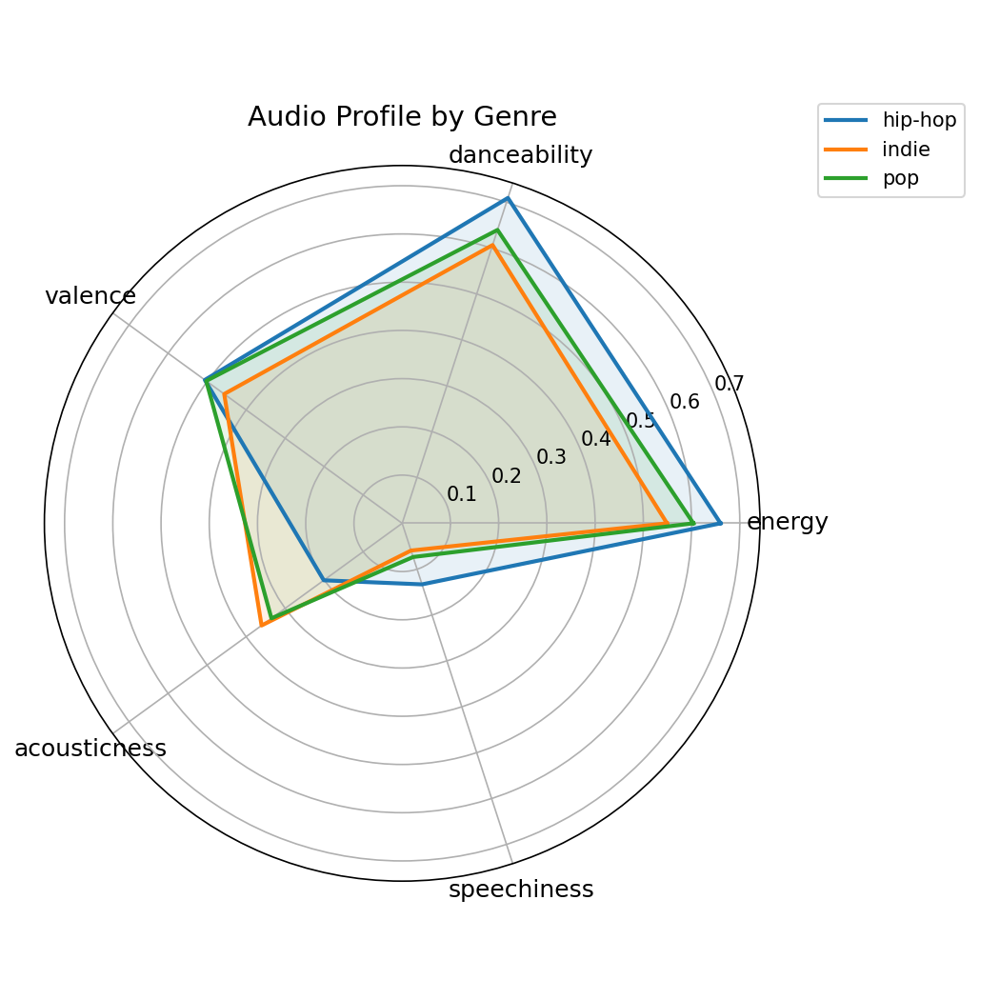

# Spotify Audio Features Analysis

Analyzing what makes songs sound different across genres using a dataset
of 300 Spotify tracks across Pop, Hip Hop, and Indie.

## Tools
Python · pandas · seaborn · matplotlib · Jupyter · Kaggle

## What I built
Loaded and analyzed 300 tracks across 3 genres, exploring audio features
including energy, danceability, valence, tempo, and acousticness.
Generated 4 visualizations: correlation heatmap, scatter plot, box plot,
and radar chart.

## Key findings
1. **[Hip Hop] has the highest energy (0.660) and highest valence (0.506)** — suggesting
   intensity equals happiness.

2. **Energy and loudness are strongly correlated (r ≈ 0.8)** — they measure
   nearly the same thing, which matters when building predictive models since
   including both would be redundant.

3. **Indie is the most acoustic (0.360) and least danceable (0.607)** — consistent
   with its guitar-driven, introspective character.
   
## Charts

  
  

  
  

## How to run
1. Clone this repo
2. pip install pandas seaborn matplotlib numpy
3. Open spotify_analysis.ipynb in Jupyter
